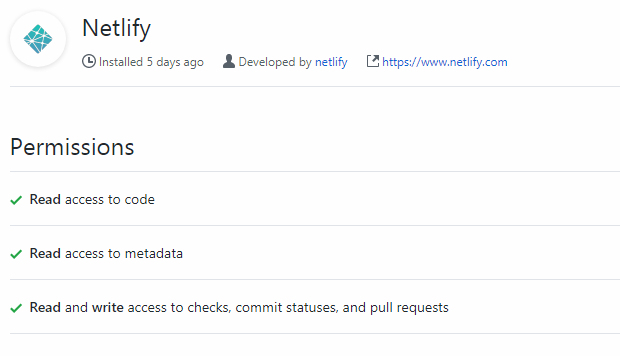

Configuring a Hugo project so it can deploy to both Netlify and GitHub Pages
<!-- more -->
As the [Hugo documentation explains](https://gohugo.io/hosting-and-deployment/hosting-on-github/#github-user-or-organization-pages) it's incredibly easy to deploy a Hugo-based site to [GitHub Pages](https://pages.github.com/). 

The essence of their approach is to create a git submodule in the `/public` directory that is linked to the relevant publish repository   `NAME.github.io`.

They even give an example shell script:
```shell
#!/bin/bash

echo -e "\033[0;32mDeploying updates to GitHub...\033[0m"

# Build the project.
hugo # if using a theme, replace with `hugo -t <YOURTHEME>`

# Go To Public folder
cd public
# Add changes to git.
git add .

# Commit changes.
msg="rebuilding site `date`"
if [ $# -eq 1 ]
  then msg="$1"
fi
git commit -m "$msg"

# Push source and build repos.
git push origin master

# Come Back up to the Project Root
cd ..
```

This works perfectly if you only want to publish to GitHub, but for this site I publish to two locations:

* [Netlify](https://app.netlify.com/) for the [main site[(https://www.synesthesia.cvo.uk)]
* [GitHub Pages](https://synesthesia.gitgub.io) as secondary backup of my published site

If you add the published GitHub Pages repo as a submodule in the site source (as suggwsted in the Hugo docs) then the Netlify build falls over with permission errors.

Even if you give Netlify access to the second repository it still fails, but as can be seen from [Github Applicaiton settings](https://github.com/settings/installations), Netlify only secures read access to code:


I found a way to make this work, by **not** adding a submodule for the GitHub pages repo:

First, make sure `/content` is ignored:



Secondly add the following script at the root of your Hugo project:



Now you can run `./deploy-github.sh` to build the site and push to GitHub pages...


