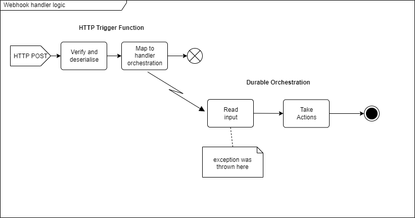
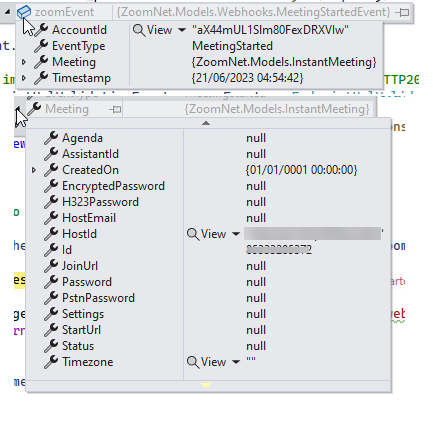

## Context

This issue surfaced during development of a webhook application intended to receive events from Zoom (e.g. meeting started, recording completed etc.) and trigger consequential actions via Azure Durable Functions orchestrations.

The application relies on the [Jericho/ZoomNet](https://github.com/Jericho/ZoomNet) library for Zoom-specific methods, including the serialisation and deserialisation of webhook events.

The high-level logic looks like this:



## The problem

A typical incoming webhook payload (obfuscated) might look like this:

```json
{
  "event":"meeting.started",
  "payload":{
    "account_id":"XXXXXXXXXXXXX",
    "object":{
      "duration":0,
      "start_time":"2023-06-21T04:54:42Z",
      "timezone":"",
      "topic":"XXX",
      "id":"12345678901",
      "type":1,
      "uuid":"abcdefghijklMNOPqr+xrQ==",
      "host_id":"XXXXXXXXXXXXXXX"
    }
  },
  "event_ts":1687323282665}
```

Inspecting the deserialised object in the Visual Studio debugger shows that ZoomNet correctly maps this to a nested object:



In the HttpTrigger function we wrap the event into a parameter object...

```csharp

// ...
 MeetingStartedEvent => (
     nameof(MeetingStartedOrchestration),
     new ZoomMeetingStartedOrchestrationArgument(theEvent as MeetingStartedEvent)
// ...

public class ZoomMeetingStartedOrchestrationArgument : OrchestrationArgument
{
    public MeetingStartedEvent Event { get; set; }

    public ZoomMeetingStartedOrchestrationArgument(MeetingStartedEvent @event)
    {
        Event = @event;
    }
}
```

and dispatch the orchestration in the usual way:

```csharp
var instanceId = await starter.StartNewAsync(orchestration, argument);
```

The problem comes in the downstream orchestration when trying to access the orchestration argument:

```csharp

 [FunctionName(nameof(MeetingStartedOrchestration))]
 public async Task<OrchestrationResult> RunOrchestrator(
     [OrchestrationTrigger] IDurableOrchestrationContext context)
 {
    //...
    var input = context.GetInput<ZoomMeetingStartedOrchestrationArgument>();
    // ...
 }
```
which throws an exception like this:

```
Newtonsoft.Json.JsonSerializationException: Could not create an instance of type ZoomNet.Models.Meeting. Type is an interface or abstract class and cannot be instantiated.
```

## Analysis

It's always worth remembering that Azure Durable Functions works by serializing arguments and results between triggers, worflows and actions. The full list of data that will be serialized and persisted when using features of Durable Functions is:

- All inputs and outputs of orchestrator, activity, and entity functions, including any IDs and unhandled exceptions
- Orchestrator, activity, and entity function names
- External event names and payloads
- Custom orchestration status payloads
- Orchestration termination messages
- Durable timer payloads
- Durable HTTP request and response URLs, headers, and payloads
- Entity call and signal payloads
- Entity state payloads
&mdash; [source](https://learn.microsoft.com/en-us/azure/azure-functions/durable/durable-functions-serialization-and-persistence?tabs=csharp-inproc#task-hub-contents)

So by attempting to read the orchestration arguments from the `IDurableOrchestrationContext` under the hood a deserialization is happening.

Looking at the model classes in ZoomNet:

```csharp
public abstract class Event
{
	/// <summary>
	/// Gets or sets the type of event.
	/// </summary>
	public EventType EventType { get; set; }
	[JsonPropertyName("timestamp")]
	[JsonConverter(typeof(EpochConverter))]
	public DateTime Timestamp { get; set; }
}

public class MeetingEvent : Event
{
	/// <summary>
	/// Gets or sets the unique identifier of the account in wich the event occured.
	/// </summary>
	[JsonPropertyName("account_id")]
	public string AccountId { get; set; }

	/// <summary>
	/// Gets or sets the meeting object.
	/// </summary>
	[JsonPropertyName("object")]
	public Meeting Meeting { get; set; }
}
```
The problem is triggered by the classes for `Meeting` because the inheritance has an abstract base:

```csharp

public abstract class Meeting
{
	// all the meeting properties
}

public class InstantMeeting : Meeting
{
}
```

## Fix

I can't change the model structure without abandoning the library, which I am reluctant to do as it seems to do most of what I need.

After a bit of searching I found the documentation for [JsonSerializerSettings.TypeNameHandling](https://www.newtonsoft.com/json/help/html/T_Newtonsoft_Json_TypeNameHandling.htm) in the Json.Net docs.

With further search I found [Data persistence and serialization in Durable Functions (Azure Functions)](https://learn.microsoft.com/en-us/azure/azure-functions/durable/durable-functions-serialization-and-persistence?tabs=csharp-inproc), which documents that the default settings for serialisation of inputs, outputs and state are:

```csharp
JsonSerializerSettings
{
    TypeNameHandling = TypeNameHandling.None,
    DateParseHandling = DateParseHandling.None,
}
```

Looking specifically at [Customizing serialization with Dependency Injection](https://learn.microsoft.com/en-us/azure/azure-functions/durable/durable-functions-serialization-and-persistence?tabs=csharp-inproc#customizing-serialization-with-dependency-injection) I was able to modify the `Startup` class of my app:

```csharp
[assembly: FunctionsStartup(typeof(Startup))]
public class Startup : FunctionsStartup
{
  // ...
  // existing logic
  // ...

  public override void Configure(IFunctionsHostBuilder builder)
  {
    //...
    // modify JSON.net behaviour on Durable Functions
    builder.Services.AddSingleton<IMessageSerializerSettingsFactory, CustomMessageSerializerSettingsFactory>();

    //...
  }

  internal class CustomMessageSerializerSettingsFactory : IMessageSerializerSettingsFactory
  {
      public JsonSerializerSettings CreateJsonSerializerSettings()
      {
          // Return your custom JsonSerializerSettings here
          return new JsonSerializerSettings
          {
              TypeNameHandling = TypeNameHandling.All,
              DateParseHandling = DateParseHandling.None,
          };
      }
  }
}
```

After deploying that change the function works as expected.
