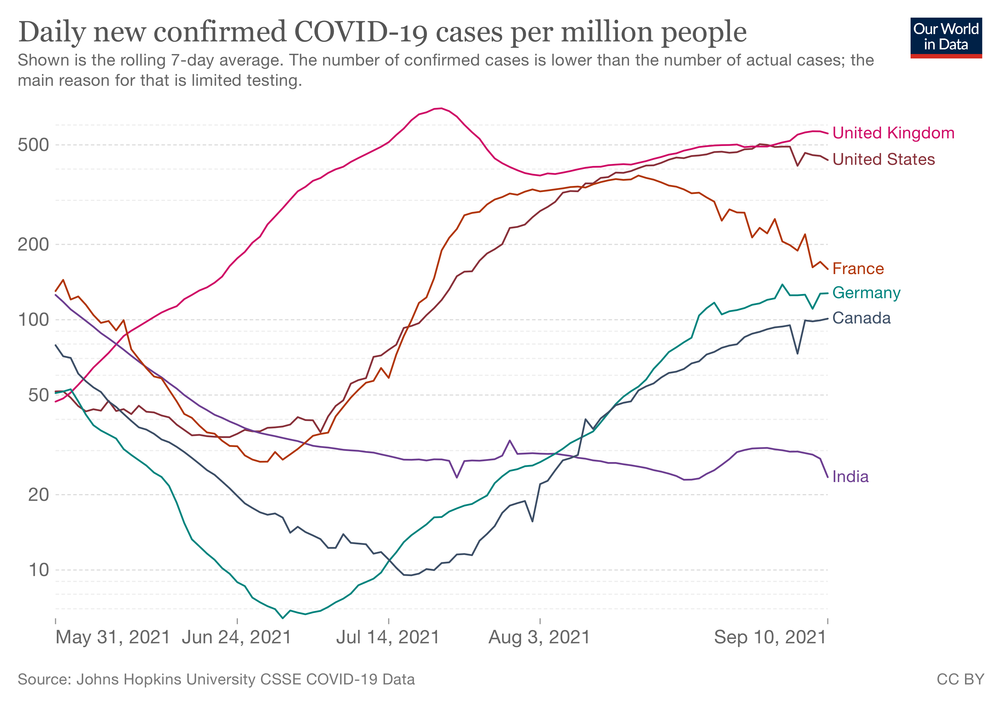

"Global Britain" [^1] stands out again! Sadly this time it is, once again, in terms of Covid-19 case rates, as this chart shows:

*(chart [source](https://ourworldindata.org/covid-cases))*

In a Twitter [thread](https://twitter.com/chrischirp/status/1436393157579743253) today [^2] Prof. Christina Pagel shares more detailed information about the current situation in the UK:

- Scotland has the highest rates, England the lowest, but everywhere higher than 12 months ago
- hospitalisation rising everywhere
- deaths are increasing, currently at ~1000 per week, way lower than the last peak, but significantly up on the Spring of 2021

All this is before the effect of schools opening in the last week, let alone the return of university students in October, filters through into infections. 

It’s hardly surprising that commentators are predicting a “firebreak” lockdown in October. To the sceptical observer of how the UK government has handled the pandemic, [ministerial denials](https://www.theguardian.com/world/2021/sep/07/no-10-not-ruling-out-firebreak-lockdown-if-covid-cases-rise) merely confirm the likelihood.

It’s clear from the data that Covid is “still a thing” in the UK, yet you only have to go into shops or on public transport to see more and more people not wearing masks, let alone having any sense of social distancing. Is it ignorance? Is it a dogged determination not to use “common sense”? Or is it a combination of “issue fatigue” coupled with the much lower profile of the pandemic in the popular media?

This personal observation is at odds with a recent survey by the Office of National Statistics[^3] that reports:

> This wave, over the period of 25 August to 5 September 2021, based on adults in Great Britain:
> - A high proportion of adults still felt that measures to slow the spread of coronavirus (COVID-19) were either very important or important; the measures included wearing a face covering (87% this wave, 88% last wave between the period 18 and 22 August) and socially distancing from others not in their household (87% this wave, 86% last wave).
> - The proportion of adults reporting to wear face coverings at some point in the last seven days when outside their home (89%) was similar to last wave (90%), as was the proportion of adults who always or often maintain social distancing (46% this wave, 45% last wave).

Are my experiences untypical? Or are people just lying to the statisticians?

[^1]: the phrase “Global Britain” is [widely used](https://www.gov.uk/government/collections/global-britain-delivering-on-our-international-ambition) by the UK government at the time of writing this post: both as a label for policy and a rhetorical shorthand that stands for large chunks of the populist and separatist agenda. 

[^2]: [Archive copy of thread](https://1drv.ms/b/s!AlU3oK2wFhcrgrVAo7AGLfUaJWyy3w)

[^3]: [Coronavirus and the social impacts on Great Britain: 10 September 2021](https://www.ons.gov.uk/peoplepopulationandcommunity/healthandsocialcare/healthandwellbeing/bulletins/coronavirusandthesocialimpactsongreatbritain/latest)

