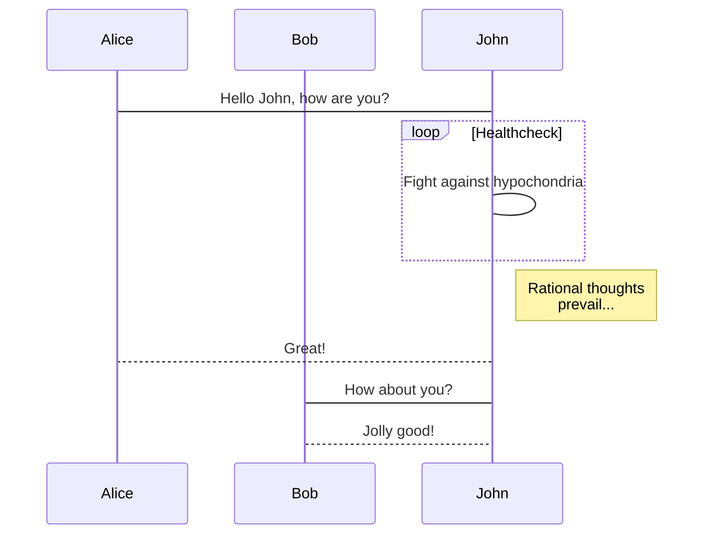
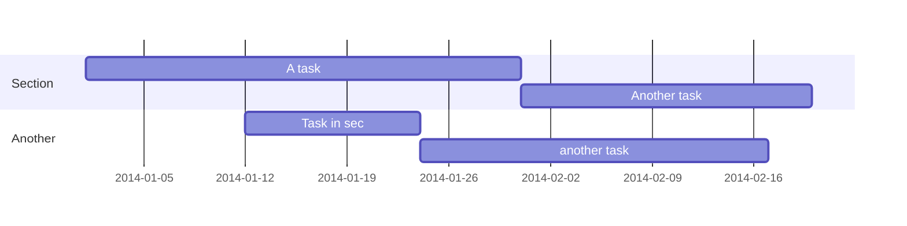

```markmap {height="200px"}
- Hugo Modules
  - wowchemy
  - wowchemy-plugins-netlify
  - wowchemy-plugins-netlify-cms
  - wowchemy-plugins-reveal
```




 ```mermaid
 graph TD;
 A-->B;
 A-->C;
 B-->D;
 C-->D;
```





```python
# Example of code highlighting
input_string_var = input("Enter some data: ")
print("You entered: {}".format(input_string_var))
```

