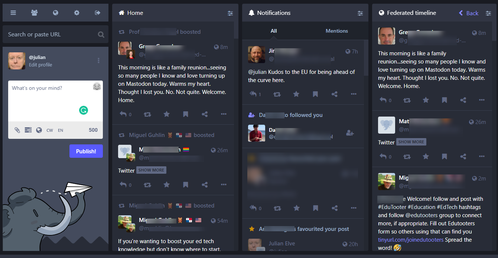

---
title: Mastodon
summary: An introduction to Mastodon and the Fediverse
authors: []
tags: ['tutorials', 'fediverse', 'mastodon']
categories: []
date: '2022-11-18'
slides:
  # Choose a theme from https://github.com/hakimel/reveal.js#theming
  theme: black
  # Choose a code highlighting style (see Hugo docs on Chroma)
  #   Light style: github-light. Dark style: dracula (default).
  highlight_style: dracula
  reveal_options:
    slideNumber: true
    hash: true
---
# Mastodon social networking

---
Mastodon is a social network tool that forms part of the Fediverse.

In other words there are lots of different servers which all speak together to form a giant federated network.

*Some* of the larger servers can be seen [here](https://joinmastodon.org/servers), but as of 17/11/2022 there were over 6,000 servers in the network

---
Once you have joined a server (more on that later), you can use a wide range of tools to connect, including a web interface and a choice of mobile apps

---
Screenshot of Mastodon web interface (v 4.02)

