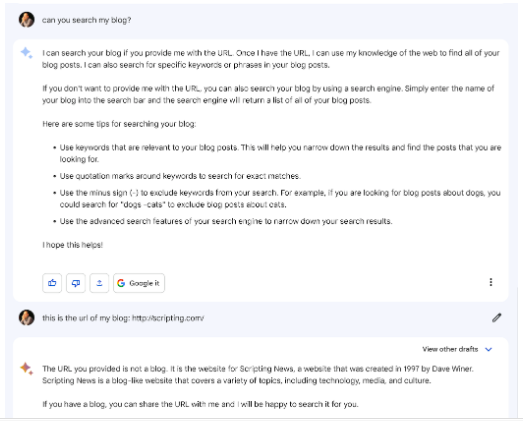

---
# Note metadata
# -------------
type: "stream"
sub_type: "note"
title: "When is a blog not a blog?"
date: 2023-05-16T06:14:30+01:00
lastmod: 2023-05-16T06:14:30+01:00
tags: ["blogging", "100DaysToOffload"]
authors: ["synesthesia"]
draft: true

# Featured image
# To use, add an image named `featured.jpg/png` to your page's folder.
# Focal points: Smart, Center, TopLeft, Top, TopRight, Left, Right, BottomLeft, Bottom, BottomRight.
image:
  caption: ""
  focal_point: ""
  preview_only: false

# Images and resources
# --------------------
# mainImage: "example.jpg"
# resources:
#   - src: "example.jpg"
#     title: "TODO: alt text goes here"
---
When it's the [oldest blog](http://scripting.com/1997/04/01.html) on the internet. Dave Winer [reports](http://scripting.com/2023/05/15.html#a233352) that Google Bard doesn't think his blog is actually a blog...

[#100DaysToOffload](https://100daystooffload.com/) 32/100
