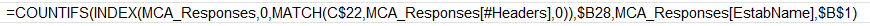

---
# Note metadata
# -------------
type: "stream"
sub_type: "note"
title: "How did I not know this about Excel?"
date: 2023-11-15T06:46:31Z
lastmod: 2023-11-15T06:46:31Z
tags: ["100DaysToOffload", "MSOffice"]
authors: ["synesthesia"]
draft: false

# Featured image
# To use, add an image named `featured.jpg/png` to your page's folder.
# Focal points: Smart, Center, TopLeft, Top, TopRight, Left, Right, BottomLeft, Bottom, BottomRight.
image:
  caption: ""
  focal_point: ""
  preview_only: false

# Images and resources
# --------------------
# mainImage: "example.jpg"
# resources:
#   - src: "example.jpg"
#     title: "TODO: alt text goes here"
---
Only just found out that if you set an Excel cell format to `Text`, it displays formulae as a literal without evaluation.

How long did I chase around that issue yesterday?  😠

